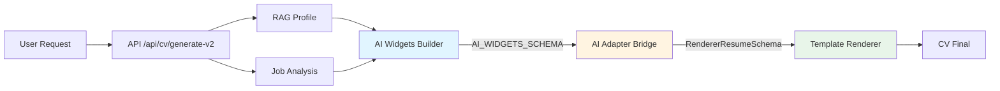

# Architecture V2 - Génération CV avec Widgets

## Vue d'ensemble

L'architecture V2 introduit une séparation claire entre la génération de contenu (IA) et le rendu visuel (Frontend), via un système de "widgets" scorés et un adaptateur (Bridge).

### Philosophie : Cerveau / Bridge / Corps

- **Cerveau (IA)** : Génère des widgets de contenu scorés avec métadonnées de pertinence
- **Bridge (Adaptateur)** : Convertit et trie les widgets selon leur score de pertinence
- **Corps (Renderer)** : Affiche le CV final en utilisant les templates existants

## Architecture en 3 couches



## Schémas JSON

### AI_WIDGETS_SCHEMA

Format produit par l'IA (Gemini). Chaque widget représente un élément de contenu avec un score de pertinence.

```typescript
interface AIWidget {
    id: string;
    type: "summary_block" | "experience_bullet" | "experience_header" | 
          "skill_item" | "skill_group" | "education_item" | 
          "project_item" | "language_item" | "meta_note";
    section: "header" | "summary" | "experiences" | "skills" | 
             "education" | "projects" | "languages" | "references" | "meta";
    text: string;                    // Contenu brut
    relevance_score: number;         // 0-100 : score de pertinence pour l'offre
    sources?: {                      // Références vers le RAG source
        rag_experience_id?: string;
        rag_realisation_id?: string;
        rag_path?: string;
    };
    quality?: {                      // Signaux de qualité
        has_numbers?: boolean;
        length?: number;
        grounded?: boolean;
    };
}

interface AIWidgetsEnvelope {
    profil_summary?: {
        prenom?: string;
        nom?: string;
        titre_principal?: string;
        localisation?: string;
        elevator_pitch?: string;
    };
    job_context?: {
        company?: string;
        job_title?: string;
        match_score?: number;
        keywords?: string[];
    };
    widgets: AIWidget[];             // Minimum 1 widget
    meta?: {
        model?: string;
        created_at?: string;
        locale?: string;
        version?: string;
    };
}
```

**Fichier** : `lib/cv/ai-widgets.ts`

### RendererResumeSchema

Format consommé par le renderer (templates existants). Réutilise le type `CVData` déjà utilisé par tous les templates.

```typescript
type RendererResumeSchema = CVData;  // Voir components/cv/templates
```

**Fichier** : `lib/cv/renderer-schema.ts`

## Pipeline de génération

### 1. Génération des Widgets (Cerveau IA)

**Fichier** : `lib/cv/generate-widgets.ts`

```typescript
generateWidgetsFromRAGAndMatch({
    ragProfile: RAGData,
    matchAnalysis: MatchAnalysis,
    jobDescription: string
}): Promise<AIWidgetsEnvelope | null>
```

**Processus** :
1. Construction du prompt Gemini avec RAG + analyse de match
2. Appel à Gemini 3.0 Pro
3. Parsing JSON (nettoyage markdown fences si présent)
4. Validation avec Zod (`aiWidgetsEnvelopeSchema`)
5. Retour de l'enveloppe validée ou `null` en cas d'erreur

**Prompt** : `lib/ai/prompts.ts` → `getAIWidgetsGenerationPrompt()`

### 2. Conversion et Tri (Bridge)

**Fichier** : `lib/cv/ai-adapter.ts`

```typescript
convertAndSort(
    input: AIWidgetsEnvelope,
    options?: {
        minScore?: number;              // Par défaut: 50
        maxExperiences?: number;        // Par défaut: 6
        maxBulletsPerExperience?: number; // Par défaut: 6
    }
): RendererResumeSchema
```

**Processus** :
1. **Filtrage** : Exclusion des widgets avec `relevance_score < minScore`
2. **Tri** : Tri décroissant par `relevance_score`
3. **Partition** : Groupement des widgets par section
4. **Construction** :
   - `profil` : Depuis `profil_summary` + widgets `summary_block`
   - `experiences` : Groupement par `rag_experience_id`, limitation `maxExperiences`
   - `competences` : Extraction depuis widgets `skill_item` / `skill_group`
   - `formations` : Depuis widgets `education_item`
   - `langues` : Depuis widgets `language_item`
5. **Retour** : CVData prêt pour le renderer

**Algorithme de groupement expériences** :
- Les widgets avec même `rag_experience_id` sont groupés
- `experience_header` → titre de l'expérience
- `experience_bullet` → réalisations (limitées à `maxBulletsPerExperience`)
- Tri final par meilleur score de l'expérience

### 3. Adaptation Template (Spatial)

**Fichier** : `lib/cv/validator.ts`

```typescript
fitCVToTemplate({
    cvData: RendererResumeSchema,
    templateName: string,
    includePhoto: boolean,
    jobOffer?: JobOfferContext
}): {
    cvData: CVData,
    compressionLevelApplied: number,
    dense: boolean,
    unitStats: UnitStats
}
```

Adapte le CV au template choisi en respectant les contraintes spatiales (A4).

### 4. Rendu Final

**Fichier** : `components/cv/CVRenderer.tsx`

Utilise les templates existants (`ModernTemplate`, `TechTemplate`, etc.) pour afficher le CV.

## Différences V1 vs V2

| Aspect | V1 (Ancienne méthode) | V2 (Widgets) |
|--------|----------------------|--------------|
| **Architecture** | Monolithique | 3 couches (Cerveau/Bridge/Corps) |
| **Génération IA** | Prompt unique → CV optimisé directement | Prompt → Widgets scorés → Conversion |
| **Contrôle qualité** | Dans le prompt | Post-traitement déterministe (filtrage/tri) |
| **Traçabilité** | Limitée | Chaque widget référencé vers source RAG |
| **Flexibilité** | Difficile d'ajuster | Facile (modifier options `convertAndSort`) |
| **Testabilité** | Difficile (tout dans l'IA) | Facile (conversion déterministe) |
| **Métadonnées** | Basiques | Riches (widgets_total, widgets_filtered, scores) |

## Guide d'utilisation

### Pour les développeurs

#### Générer un CV V2

```typescript
// 1. Depuis le dashboard
// Bouton "Générer avec V2 (Widgets)" dans /dashboard/analyze/[id]

// 2. Via l'API
POST /api/cv/generate-v2
{
    "analysisId": "uuid",
    "template": "modern",
    "includePhoto": true
}
```

#### Personnaliser la conversion

```typescript
import { convertAndSort } from "@/lib/cv/ai-adapter";

const cvData = convertAndSort(widgetsEnvelope, {
    minScore: 60,              // Plus strict (score minimum 60)
    maxExperiences: 4,         // Moins d'expériences
    maxBulletsPerExperience: 4 // Moins de bullets par expérience
});
```

#### Tester la génération de widgets

```typescript
import { generateWidgetsFromRAGAndMatch } from "@/lib/cv/generate-widgets";

const widgets = await generateWidgetsFromRAGAndMatch({
    ragProfile: ragData,
    matchAnalysis: analysis,
    jobDescription: jobText
});

if (widgets) {
    console.log(`Généré ${widgets.widgets.length} widgets`);
    console.log(`Scores: ${widgets.widgets.map(w => w.relevance_score).join(', ')}`);
}
```

### Pour les utilisateurs

1. **Analyser une offre** : `/dashboard/analyze`
2. **Générer CV V2** : Cliquer sur "Générer avec V2 (Widgets)" dans la page d'analyse
3. **Visualiser** : Le CV s'affiche avec badge "V2 Widgets" et stats (X/Y widgets)
4. **Comprendre** : Section "Généré avec V2 Widgets" dans `CVOptimizationExplainer`

## Métadonnées V2

Chaque CV généré avec V2 contient des métadonnées dans `cv_data.cv_metadata` :

```typescript
{
    generator_type: "v2_widgets",
    widgets_total: 25,           // Nombre total de widgets générés
    widgets_filtered: 18,        // Nombre de widgets retenus (score >= 50)
    generator_model: "gemini-3-pro-preview",
    generator_version: "6.0.0",
    relevance_scoring_applied: true,
    // ... autres métadonnées
}
```

**Affichage dans l'UI** :
- Badge "V2 Widgets" dans la navbar (`/dashboard/cv/[id]`)
- Stats widgets dans `CVOptimizationExplainer`
- Badge "V2" dans la liste des CVs (`CVCard`)

## Troubleshooting

### Erreur : "Erreur génération widgets IA"

**Causes possibles** :
- RAG profile incomplet ou invalide
- Erreur API Gemini (quota, timeout)
- Réponse JSON invalide de Gemini

**Solutions** :
- Vérifier que le profil RAG est complet (`/dashboard/profile`)
- Vérifier les logs serveur pour détails Gemini
- Réessayer (erreur temporaire possible)

### Erreur : "Erreur lors de la conversion des widgets"

**Causes possibles** :
- Schéma `AIWidgetsEnvelope` invalide
- Widgets avec scores invalides (< 0 ou > 100)

**Solutions** :
- Vérifier les logs pour le widget problématique
- Le bridge devrait gérer les cas edge, mais signaler si récurrent

### CV vide ou incomplet

**Causes possibles** :
- Tous les widgets filtrés (scores < minScore)
- RAG profile trop pauvre

**Solutions** :
- Réduire `minScore` dans les options (actuellement 50)
- Enrichir le profil RAG avec plus de données

### Performance lente

**Causes possibles** :
- Appel Gemini long (10-20s normal)
- Conversion complexe avec beaucoup de widgets

**Solutions** :
- Normal : V2 utilise Gemini 3.0 Pro (plus lent mais meilleure qualité)
- Optimisation future : cache des widgets générés

## Fichiers clés

- `lib/cv/ai-widgets.ts` : Schémas Zod pour AI_WIDGETS_SCHEMA
- `lib/cv/generate-widgets.ts` : Génération widgets depuis RAG
- `lib/cv/ai-adapter.ts` : Bridge (conversion widgets → CVData)
- `lib/cv/renderer-schema.ts` : Type RendererResumeSchema
- `app/api/cv/generate-v2/route.ts` : Endpoint API V2
- `app/dashboard/cv-lab/page.tsx` : Laboratoire V2 (test manuel)
- `components/cv/CVOptimizationExplainer.tsx` : Affichage stats V2

## Tests

**Tests unitaires** :
- `__tests__/cv/generate-widgets.test.ts` : Génération widgets
- `__tests__/cv/ai-adapter.test.ts` : Conversion et tri
- `__tests__/api/cv/generate-v2.test.ts` : Endpoint API

**Lancer les tests** :
```bash
npm test
```

## Cache Widgets

### Architecture Cache Serveur

Le cache widgets est implémenté dans `lib/cv/widget-cache.ts` et intégré automatiquement dans l'endpoint `/api/cv/generate-widgets`.

**Table Supabase** : `widget_cache`

**Structure** :
```sql
CREATE TABLE widget_cache (
  id UUID PRIMARY KEY,
  cache_key TEXT UNIQUE NOT NULL,
  widgets JSONB NOT NULL,
  metadata JSONB NOT NULL,
  created_at TIMESTAMP NOT NULL,
  expires_at TIMESTAMP NOT NULL
);
```

### Clé de Cache

La clé de cache est générée à partir de :
- `analysisId` : ID de l'analyse d'offre
- `ragCompletenessScore` : Score de complétude RAG (0-100)
- `jobDescriptionHash` : Hash SHA256 de la description d'offre (normalisée)

**Format** : `sha256(analysisId:ragScore:jobDescriptionHash)`

**Fonction** : `generateCacheKey(analysisId, ragCompletenessScore, jobDescriptionHash)`

### Invalidation

- **TTL** : 24 heures
- **Invalidation** : Automatique après expiration (`expires_at < NOW()`)
- **Vérification** : À chaque requête, vérification cache avant génération

### Performance Gains

| Scénario | Temps Réponse |
|----------|---------------|
| Cache Hit | < 500ms |
| Cache Miss (Génération) | 15-30s |
| **Gain** | **30-60x plus rapide** |

### Utilisation

Le cache est **transparent** : aucune action requise côté client. L'endpoint `/api/cv/generate-widgets` gère automatiquement :
1. Vérification cache avant génération
2. Sauvegarde cache après génération réussie
3. Retour flag `cached: true` dans les métadonnées si cache hit

**Exemple** :
```typescript
const response = await fetch('/api/cv/generate-widgets', {
  method: 'POST',
  body: JSON.stringify({ analysisId: 'xxx' })
});

const { widgets, metadata } = await response.json();
if (metadata.cached) {
  console.log('Widgets récupérés du cache');
}
```

---

## Advanced Scoring

### Critères de Scoring

Le scoring avancé évalue les widgets selon 5 critères avec poids configurables :

| Critère | Poids Défaut | Description |
|---------|--------------|-------------|
| **Pertinence offre** | 40% | Alignement avec l'offre d'emploi |
| **Score ATS** | 30% | Matching keywords et missing keywords |
| **Impact métrique** | 15% | Présence de chiffres et quantifications |
| **Récence** | 10% | Expériences récentes privilégiées |
| **Séniorité** | 5% | Alignement niveau d'expérience avec le poste |

**Fichier** : `lib/cv/advanced-scoring.ts`

### Calcul du Score

```typescript
const compositeScore =
    relevanceScore * 0.4 +
    atsScore * 0.3 +
    metricsScore * 0.15 +
    recencyScore * 0.1 +
    seniorityScore * 0.05;
```

### Score ATS

Le score ATS (Applicant Tracking System) est calculé dans `lib/cv/ats-scorer.ts` :

- **Missing keywords** : 20 points chacun (priorité haute)
- **Keywords normaux** : 5 points chacun
- **Chiffres présents** : 10 points
- **Format standardisé** : 5 points
- **Maximum** : 100 points

### Score Impact Métrique

- **Présence chiffres** : 10 points par chiffre
- **Pourcentages** : +15 points
- **Montants (€, $)** : +15 points
- **Volumes (+, millions)** : +10 points

### Score Récence

Basé sur l'ancienneté de l'expérience :

- **0-2 ans** : 100 points
- **2-5 ans** : 80 points
- **5-10 ans** : 50 points
- **> 10 ans** : 20 points

### Score Séniorité

Alignement niveau du poste avec niveau dans le widget :

- **Match parfait** (senior/senior, junior/junior) : 100 points
- **Match partiel** : 80 points
- **Décalage** : 60 points
- **Neutre** : 70 points

### Re-scoring Workflow

1. **Génération widgets** : Widgets générés avec score de pertinence de base
2. **Re-scoring** : Application du scoring avancé si `jobOfferContext` disponible
3. **Tri** : Widgets triés par score final décroissant
4. **Filtrage** : Exclusion widgets avec score < `minScore`

**Fichier** : `lib/cv/client-bridge.ts` → `convertWidgetsToCVWithAdvancedScoring`

**Logs** : Logs détaillés pour debugging (delta scores, widgets améliorés/dégradés)

---

## Client-Side Processing

### Architecture Frankenstein

L'architecture V2 utilise un traitement côté client pour réactivité maximale :

**Flow** :
1. **Serveur** : Génère widgets une fois (ou récupère du cache)
2. **Client** : Convertit widgets → CVData
3. **Client** : Applique template
4. **Client** : Preview temps réel
5. **Client** : Switch thème instantané (< 200ms)

**Avantages** :
- Switch thème sans re-génération
- Preview instantané
- Réduction charge serveur
- Meilleure UX

### Conversion Côté Client

**Fichier** : `lib/cv/client-bridge.ts`

**Fonctions** :
- `convertWidgetsToCV` : Conversion basique
- `convertWidgetsToCVWithValidation` : Conversion + validation anti-hallucination
- `convertWidgetsToCVWithAdvancedScoring` : Conversion + scoring avancé

**Exemple** :
```typescript
import { convertWidgetsToCVWithAdvancedScoring } from '@/lib/cv/client-bridge';

const { cvData, validation } = convertWidgetsToCVWithAdvancedScoring(
  widgetsEnvelope,
  ragProfile,
  jobOfferContext,
  {
    minScore: 60,
    maxExperiences: 5
  },
  true // enableAdvancedScoring
);
```

### Cache LocalStorage/SessionStorage

**Fichier** : `lib/cv/client-cache.ts`

**Fonctions** :
- `saveWidgetsToCache` : Sauvegarde widgets en localStorage
- `getWidgetsFromCache` : Récupère widgets du cache
- `saveCVDataToCache` : Sauvegarde CVData par template
- `getCVDataFromCache` : Récupère CVData du cache

**Clés de cache** :
- `widgets:${analysisId}` : Widgets pour une analyse
- `cvData:${analysisId}:${template}` : CVData pour un template

**Expiration** : 24 heures (localStorage) ou session (sessionStorage)

**Usage** :
```typescript
import { saveWidgetsToCache, getWidgetsFromCache } from '@/lib/cv/client-cache';

// Sauvegarder
saveWidgetsToCache(analysisId, widgetsEnvelope);

// Récupérer
const cached = getWidgetsFromCache(analysisId);
if (cached) {
  // Utiliser widgets du cache
}
```

---

## Évolutions futures

- [x] Cache des widgets générés (éviter régénération identique) ✅ **Implémenté v6.2.5**
- [x] Ajustement dynamique `minScore` selon qualité RAG ✅ **Implémenté v6.2.5**
- [x] Export widgets bruts pour analyse ✅ **Implémenté v6.2.5**
- [ ] Support widgets personnalisés (utilisateur peut ajouter)
- [ ] Visualisation des scores de pertinence dans l'UI (partiellement implémenté)

## Références

- Inspiration : `recup.md` (Architecture "Frankenstein")
- Schéma RAG : `RAG_STANDARD_FORMAT.md`
- Templates : `components/cv/templates/`
