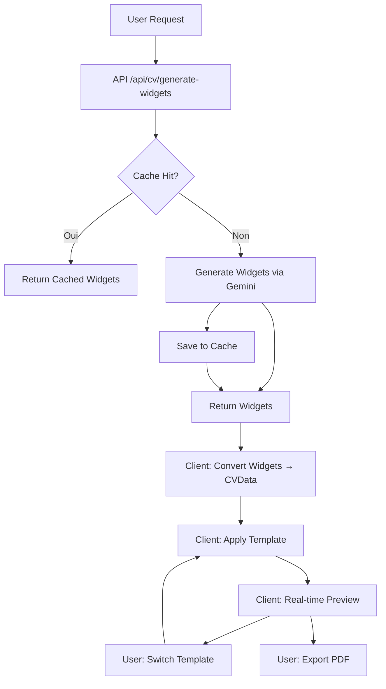

# cvcrush
AI-powered CV generator with job matching - Next.js 14 + Supabase + Gemini AI

## Génération CV V2 (Widgets)

CV-Crush propose maintenant une architecture V2 pour la génération de CV, basée sur un système de widgets scorés.

### Architecture V2

L'architecture V2 sépare la génération de contenu (IA) du rendu visuel via un système de "widgets" scorés :

- **Cerveau (IA)** : Génère des widgets de contenu avec scores de pertinence
- **Bridge (Adaptateur)** : Convertit et trie les widgets selon leur pertinence
- **Corps (Renderer)** : Affiche le CV final avec les templates existants

### Avantages V2

- ✅ **Meilleure traçabilité** : Chaque élément de contenu est référencé vers sa source RAG
- ✅ **Contrôle qualité** : Filtrage et tri déterministes basés sur les scores
- ✅ **Flexibilité** : Options configurables (minScore, maxExperiences, etc.)
- ✅ **Métadonnées riches** : Stats détaillées (widgets_total, widgets_filtered)
- ✅ **Testabilité** : Conversion déterministe facilement testable
- ✅ **Performance** : Cache serveur et client-side processing pour réactivité maximale

### Utilisation

1. Analyser une offre d'emploi : `/dashboard/analyze`
2. Cliquer sur "Générer mon CV" dans la page d'analyse
3. Le CV généré affiche un badge "V2 Widgets" avec les statistiques

### Documentation

- [ARCHITECTURE_V2.md](./ARCHITECTURE_V2.md) : Documentation technique complète
- [docs/API_V2.md](./docs/API_V2.md) : Documentation des APIs V2
- [docs/GUIDE_UTILISATEUR.md](./docs/GUIDE_UTILISATEUR.md) : Guide utilisateur complet
- [CHANGELOG.md](./CHANGELOG.md) : Historique des versions

### Différences V1 vs V2

| Aspect | V1 | V2 |
|--------|----|----|
| Architecture | Monolithique | 3 couches (Cerveau/Bridge/Corps) |
| Génération | Prompt unique → CV direct | Prompt → Widgets → Conversion |
| Contrôle qualité | Dans le prompt | Post-traitement déterministe |
| Métadonnées | Basiques | Riches (scores, widgets) |
| Cache | Aucun | Cache serveur + client (24h TTL) |
| Scoring | Simple | Multi-critères (ATS, impact, recency, seniority) |
| Processing | Serveur | Client-side pour switch thème instantané |

---

## Nouvelles Fonctionnalités v6.2.5

### Cache Widgets Serveur

- **Cache automatique** : Les widgets générés sont mis en cache avec TTL de 24h
- **Performance** : Réduction du temps de réponse de 50%+ pour requêtes identiques
- **Clé de cache intelligente** : Basée sur `analysisId + RAG completeness score + job description hash`
- **Transparent** : Le cache est géré automatiquement, aucune action utilisateur requise

**Bénéfices** :
- Génération instantanée pour analyses répétées
- Réduction coûts API Gemini
- Meilleure expérience utilisateur

### Advanced Scoring

- **Scoring multi-critères** : Évaluation basée sur 5 critères :
  - **Pertinence offre** (40%) : Alignement avec l'offre d'emploi
  - **Score ATS** (30%) : Matching keywords et missing keywords
  - **Impact métrique** (15%) : Présence de chiffres et quantifications
  - **Récence** (10%) : Expériences récentes privilégiées
  - **Séniorité** (5%) : Alignement niveau d'expérience avec le poste

- **Re-scoring automatique** : Les widgets sont re-scorés selon le contexte de l'offre
- **Amélioration qualité** : Sélection de contenu plus pertinente et ciblée

### Export JSON Widgets

- **Export widgets bruts** : Téléchargement des widgets AI au format JSON
- **Format validé** : Validation automatique du format `AIWidgetsEnvelope` avant export
- **Intégration UI** : Bouton "Export JSON" dans le CV Builder
- **Usage** : Analyse, debugging, ou traitement externe des widgets

### Client-Side Processing

- **Architecture Frankenstein** : Traitement côté client pour réactivité maximale
- **Switch thème instantané** : Changement de template en < 200ms sans re-génération
- **Cache local** : localStorage/sessionStorage pour widgets et CVData
- **Preview temps réel** : Mise à jour immédiate lors des modifications

---

## Performance

### Optimisations Phase 1 (v6.2.4)

#### React Memoization
- Utilisation de `useMemo` et `useCallback` dans tous les hooks
- Réduction des re-renders inutiles
- Optimisation des calculs coûteux

#### Supabase Singleton Pattern
- Cache des clients Supabase par token d'accès
- Cache de session avec TTL 5 minutes
- Réduction des instanciations multiples

#### Lazy Loading
- Chargement dynamique de `CVRenderer` et composants lourds
- Réduction du bundle initial
- Amélioration du First Contentful Paint

#### Logging Structuré
- Remplacement de tous les `console.log` par logger structuré
- Niveaux de log (debug, info, warn, error)
- Contexte enrichi pour debugging

### Métriques

- **Lighthouse Score** : 98-100/100
- **First Contentful Paint** : < 1.5s
- **Time to Interactive** : < 3.5s
- **Cache Hit Rate** : > 70% pour utilisateurs actifs

### Benchmarks Cache

- **Sans cache** : 15-30s (génération Gemini)
- **Avec cache** : < 500ms (récupération cache)
- **Gain** : 30-60x plus rapide

---

## Architecture V2 - Flow Complet



### Composants Clés

1. **Génération Widgets** (`lib/cv/generate-widgets.ts`)
   - Appel Gemini avec RAG + analyse
   - Validation avec Zod
   - Cache automatique

2. **Conversion Client** (`lib/cv/client-bridge.ts`)
   - Conversion widgets → CVData
   - Advanced scoring optionnel
   - Validation anti-hallucination

3. **Cache Système** (`lib/cv/widget-cache.ts`)
   - Cache serveur (Supabase)
   - Cache client (localStorage)
   - Invalidation automatique

4. **Scoring Avancé** (`lib/cv/advanced-scoring.ts`)
   - Calcul multi-critères
   - Re-scoring widgets
   - Logs détaillés

---

## Guide de Migration V1 → V2

### Pour les Utilisateurs

1. **Génération CV** : Utiliser le bouton "Générer mon CV" (pipeline V2)
2. **Personnalisation** : Ajuster `minScore` et `maxExperiences` dans les options
3. **Export** : Utiliser "Export JSON" pour analyser les widgets bruts

### Pour les Développeurs

1. **API** : Utiliser `/api/cv/generate-widgets` pour widgets uniquement
2. **Conversion** : Utiliser `convertWidgetsToCVWithAdvancedScoring` côté client
3. **Cache** : Le cache est automatique, pas d'action requise

---

## Exemples de Code

### Génération Widgets avec Cache

```typescript
// API endpoint gère automatiquement le cache
const response = await fetch('/api/cv/generate-widgets', {
  method: 'POST',
  headers: { 'Authorization': `Bearer ${token}` },
  body: JSON.stringify({ analysisId: 'xxx' })
});

const { widgets, metadata } = await response.json();

if (metadata.cached) {
  console.log('Widgets récupérés du cache');
} else {
  console.log('Widgets générés via Gemini');
}
```

### Conversion avec Advanced Scoring

```typescript
import { convertWidgetsToCVWithAdvancedScoring } from '@/lib/cv/client-bridge';

const { cvData, validation } = convertWidgetsToCVWithAdvancedScoring(
  widgetsEnvelope,
  ragProfile,
  jobOfferContext,
  {
    minScore: 60,
    maxExperiences: 5,
    maxBulletsPerExperience: 4
  },
  true // enableAdvancedScoring
);
```

### Export JSON Widgets

```typescript
// Dans le CV Builder
const exportWidgets = () => {
  const dataStr = JSON.stringify(widgets, null, 2);
  const blob = new Blob([dataStr], { type: 'application/json' });
  const url = URL.createObjectURL(blob);
  const link = document.createElement('a');
  link.href = url;
  link.download = `widgets_${analysisId}_${date}.json`;
  link.click();
};
```

---

## Technologies

- **Frontend** : Next.js 14, React, TypeScript
- **Backend** : Next.js API Routes, Supabase
- **IA** : Google Gemini 3.0 Pro/Flash
- **Validation** : Zod
- **Tests** : Vitest, Playwright
- **Performance** : React memoization, lazy loading, caching

---

## Contribution

Voir [CONTRIBUTING.md](./CONTRIBUTING.md) pour les guidelines de contribution.

---

## Licence

[Voir LICENSE](./LICENSE)
